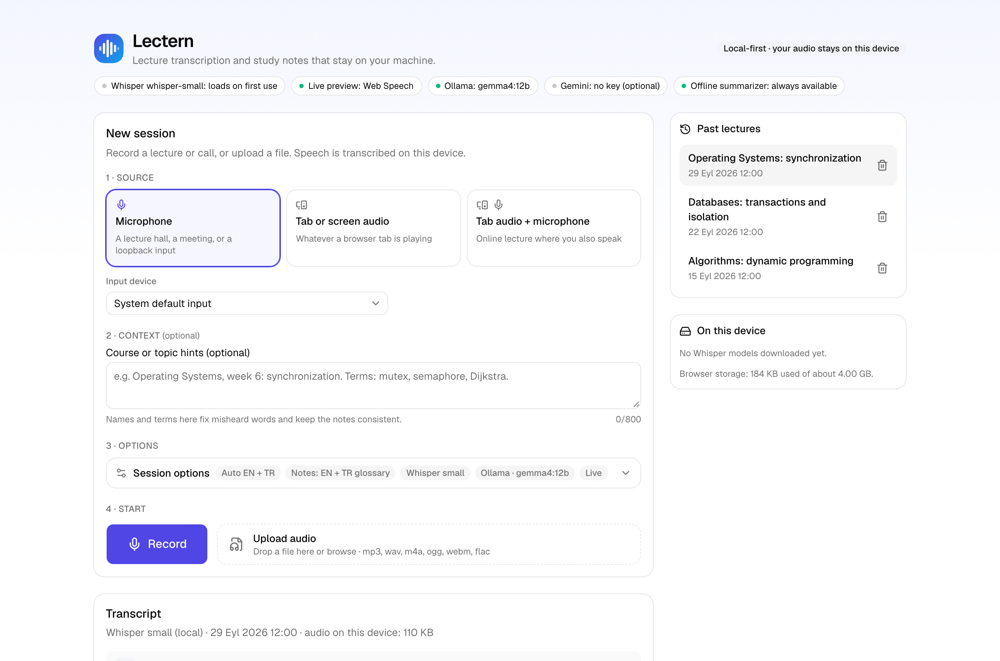
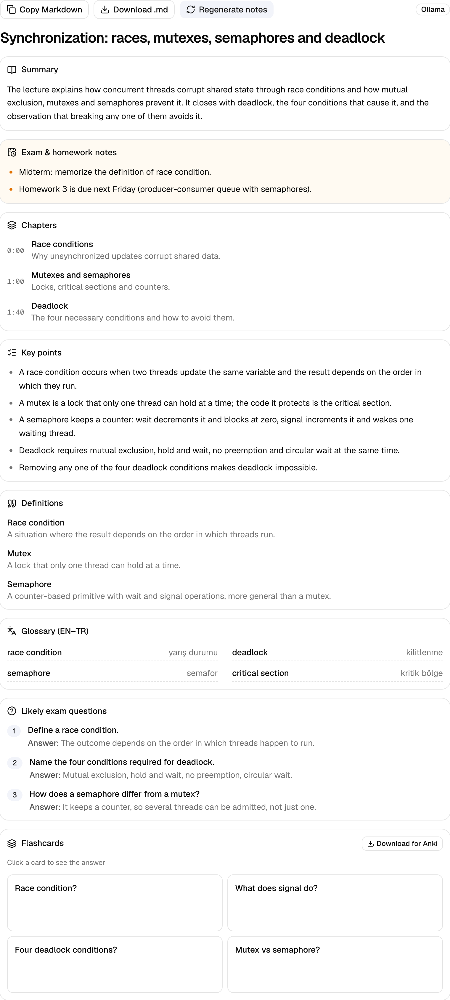
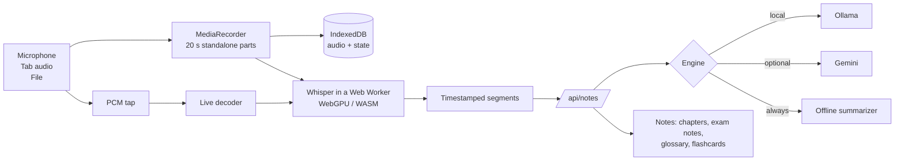
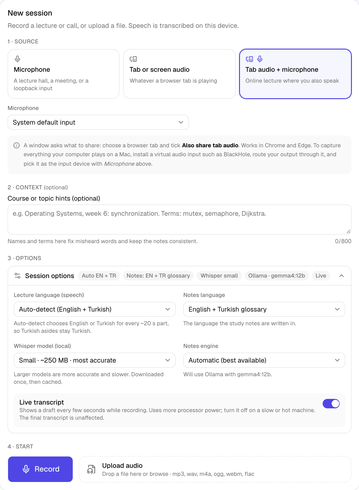

<p align="center">
  
</p>

<h1 align="center">Lectern</h1>

<p align="center">
  <strong>Lecture transcription and study notes that stay on your machine.</strong><br />
  Record or upload a lecture. Get a timestamped transcript, chapters, exam and homework notes, a bilingual glossary and flashcards.
  Built for lectures that are mostly English with Turkish asides.
</p>

<p align="center">
  <a href="https://github.com/metaxylen/lectern/actions/workflows/ci.yml"></a>
  <a href="LICENSE"></a>
  
  
  
</p>

<p align="center">
  
</p>

---

## Why Lectern

Most transcription tools are cloud services that upload your audio, bill by the minute and assume one language per recording.
Lectern is the opposite on all three counts:

- **Local-first.** Speech recognition runs in your browser (OpenAI Whisper through WebGPU or WASM). Notes are written by a
  model on your own machine (Ollama). Your audio never leaves the device.
- **Built for code-switching.** A lecturer who says _"vizede mutlaka çıkacak, race condition tanımını ezberleyin"_ mid-sentence
  is transcribed correctly: the language is detected for every 20-second part, and Turkish remarks are kept and translated
  into the notes instead of being dropped.
- **Faithful notes.** The pipeline cleans Whisper's hallucinations, removes definitions the lecture never contained,
  and collects everything said about exams and homework in a dedicated pass, so the notes are something you can study from.
- **It does not lose your recording.** Audio is written to disk while you record. A crash, a closed tab or a dead battery
  costs a couple of seconds, not the lecture.

## Features

|                     |                                                                                                                                                                                     |
| ------------------- | ----------------------------------------------------------------------------------------------------------------------------------------------------------------------------------- |
| **Sources**         | Microphone (any input, including virtual loopback devices), browser tab or screen audio, tab audio mixed with your microphone, or an uploaded file (mp3, wav, m4a, ogg, webm, flac) |
| **Live transcript** | A draft that refreshes every few seconds while you record, for any source. Replaced by the final text as each part finishes                                                         |
| **Transcript**      | Timestamped segments with language tags; click a timestamp to play from there; export to Markdown with timestamps                                                                   |
| **Notes**           | Title, summary, **exam and homework notes**, **chapters with timestamps**, key points, definitions, EN–TR glossary, likely exam questions, **flashcards** (Anki export)             |
| **Reliability**     | Crash-safe recording, per-part retry, re-transcribe with another model, cancel anywhere, audio stored on device and deletable                                                       |
| **Engines**         | Ollama (local LLM) → Gemini free tier (optional) → built-in offline summarizer; the best available is chosen automatically                                                          |
| **Quality tooling** | `npm run eval` scores the notes pipeline against real models on fixture lectures                                                                                                    |

<p align="center">
  
</p>

## Quick start

Requirements: **Node.js 22+** and **Chrome or Edge** (other browsers work with limits, see [browser support](#browser-support)).

```bash
git clone https://github.com/metaxylen/lectern.git
cd lectern
npm install
npm run dev          # http://localhost:47231
```

Open the page and press **Record** or **Upload audio**. The first run downloads the Whisper model (40–250 MB, cached by
the browser). Microphone access needs `localhost` or HTTPS.

**For good notes, install a local model.** Without one, Lectern falls back to a simple offline summarizer.

```bash
# install Ollama from https://ollama.com, then:
ollama pull gemma4:12b      # 8 GB, a good default for a 24 GB Mac
ollama serve                # if it is not already running
```

Lectern detects Ollama automatically. See [choosing a model](#choosing-a-model) for other machines.

Production build: `npm run build && npm start` (same port).

## How it works



1. **Capture.** The recorder cuts the stream into standalone 20-second files and saves them to IndexedDB every two seconds.
2. **Transcribe.** Each part is decoded to 16 kHz mono and transcribed by Whisper in a worker. The language (English or
   Turkish) is chosen per part by comparing the decoder's language logits, because transformers.js does not detect it.
3. **Clean and summarize.** Hallucinated phrases and repeats are removed. Short lectures are summarized in one pass; long ones
   part by part, then merged. Output is constrained to a JSON schema and verified against the transcript.
4. **Study.** Read the notes, jump to any chapter in the audio, flip flashcards, export Markdown or an Anki file.

More detail: [architecture](docs/architecture.md) · [notes pipeline](docs/notes-pipeline.md) · [audio sources](docs/audio-sources.md).

## Audio sources and system audio

| Source                      | Captures                 | Notes                                                    |
| --------------------------- | ------------------------ | -------------------------------------------------------- |
| Microphone                  | Your chosen input device | Also lists virtual devices such as BlackHole or Loopback |
| Browser tab or screen audio | The shared tab's sound   | Chrome/Edge. Tick **Also share tab audio** in the picker |
| Tab audio + my microphone   | Both, mixed              | For calls and online lectures where you also speak       |

A browser **cannot** capture everything a Mac plays. For system-wide audio (Zoom app, Spotify, any player), install a virtual
audio input such as [BlackHole](https://existential.audio/blackhole/), route your output through it, and pick it as the
input device. Step by step in [docs/audio-sources.md](docs/audio-sources.md). On Windows and ChromeOS the screen-share picker can
share system audio directly.

<p align="center">
  
</p>

## Choosing a model

Note quality depends mostly on the model. Lectern prefers the newest family you have installed and, within it, the largest
model that fits in about 60% of your RAM (a model that does not fit the GPU runs many times slower).

| Memory         | Suggested                                         | Notes                                                                                              |
| -------------- | ------------------------------------------------- | -------------------------------------------------------------------------------------------------- |
| 24 GB (tested) | `gemma4:12b` (8 GB)                               | Fits comfortably; the model behind the screenshots. `qwen2.5:14b` (9 GB) also works well           |
| 16 GB          | `gemma4:12b`                                      | Should fit; not tested by us                                                                       |
| 8 GB           | a smaller model such as `gemma4:e4b`              | Not tested; expect weaker summaries, especially in Turkish                                         |
| 32 GB+         | a 26–27B model (for example `qwen3.8:27b`, 4-bit) | Not tested; 4-bit 27B weights are about 18 GB, which needs raised GPU memory limits on a 24 GB Mac |

Force a model with `OLLAMA_MODEL`. Compare models on your own lectures with `npm run eval`. On the bundled fixtures,
`gemma4:12b` and `qwen2.5:14b` both cover all concepts and exam remarks; Gemma's Turkish wording is more consistent
(terms kept as _"yarış durumu (race condition)"_, no leftover English), while Qwen is slightly faster.

No local model? Set `GEMINI_API_KEY` (free at [aistudio.google.com/apikey](https://aistudio.google.com/apikey)); the transcript is
then sent to Google for note generation only.

## Privacy

- Audio is processed in your browser and stored in your browser's IndexedDB. Nothing is uploaded.
- Notes are generated by Ollama on your machine, or by Gemini **only if you provide a key**.
- Network requests Lectern makes: downloading the Whisper model from Hugging Face and the ONNX runtime files from the
  jsDelivr CDN (once, then cached), the optional Gemini call, and, **for microphone recordings while the model is still loading only**, Chrome's built-in speech recognition, which
  Google operates. There is no analytics or telemetry. Error reporting is off unless you set `NEXT_PUBLIC_ERROR_REPORT_URL`.
- Delete a lecture's audio from the transcript panel, remove downloaded models from the **On this device** panel.

## Configuration

Copy `.env.example` to `.env.local`. Everything is optional.

| Variable                       | Default                  | Purpose                                                  |
| ------------------------------ | ------------------------ | -------------------------------------------------------- |
| `OLLAMA_HOST`                  | `http://127.0.0.1:11434` | Where Ollama listens                                     |
| `OLLAMA_MODEL`                 | _(auto)_                 | Force a model                                            |
| `GEMINI_API_KEY`               | _(unset)_                | Enables the Gemini engine                                |
| `GEMINI_MODEL`                 | `gemini-flash-latest`    | Gemini model                                             |
| `NOTES_MAX_TRANSCRIPT_CHARS`   | `500000`                 | Largest transcript `/api/notes` accepts                  |
| `NOTES_RATE_LIMIT_PER_MINUTE`  | `20`                     | Per-client limit on `/api/notes`; `0` disables           |
| `NEXT_PUBLIC_CHUNK_SECONDS`    | `20`                     | Part length; shorter parts give finer language detection |
| `NEXT_PUBLIC_ERROR_REPORT_URL` | _(unset)_                | POST errors here as JSON                                 |

Invalid values fail with a readable message instead of undefined behaviour. Details: [docs/configuration.md](docs/configuration.md).

## Browser support

| Feature                          | Chrome / Edge           | Firefox                      | Safari                       |
| -------------------------------- | ----------------------- | ---------------------------- | ---------------------------- |
| Recording and transcription      | Tested (WebGPU or WASM) | Untested                     | Untested                     |
| Tab and screen audio             | Yes                     | Not supported by the browser | Not supported by the browser |
| Live transcript                  | Tested                  | Untested                     | Untested                     |
| Browser speech preview (stopgap) | Yes                     | Not supported                | Untested                     |

Developed and tested on Chromium. Whisper `small` on CPU is slower than real time; use WebGPU or pick `base`.

## Project layout

```
app/                  Next.js routes and API (notes, status, health)
components/           UI: session setup, recorder, transcript, notes, storage panel
hooks/                useLectureSession (the flow), recorder, Whisper, audio player
lib/audio/            Capture sources, PCM tap and ring buffer
lib/stt/              Whisper worker, language detection, pipeline, live transcriber
lib/notes/            Cleaning, chunking, grounding, exam-remark detection, term dictionary
lib/server/notes/     Prompts, LLM clients, single-pass and part-by-part pipeline
lib/audio-store.ts    Crash-safe audio and per-part state in IndexedDB
eval/                 Notes-quality evaluation fixtures and runner
e2e/                  Playwright tests (fake microphone, recovery, UI)
docs/                 Architecture and guides
```

## Development

```bash
npm run check         # typecheck + lint + format check + unit tests
npm test              # unit and API tests (Vitest)
npm run test:e2e      # browser tests (Playwright; first run: npx playwright install chromium)
npm run eval          # notes quality against a real engine (needs Ollama or a Gemini key)
```

CI runs typecheck, lint, format, coverage, build and the end-to-end suite on every push. See
[docs/development.md](docs/development.md) and [CONTRIBUTING.md](CONTRIBUTING.md).

## Known limitations

- Lectures and audio live in one browser profile; clearing site data deletes them. Export Markdown to keep a copy.
- Timestamps have 20-second granularity (one segment per part). Very long uploads are decoded in memory at once
  (about 460 MB per hour of audio).
- Recording is cut into standalone files, so a few milliseconds of audio can be lost at each cut.
- Automatic language detection chooses between English and Turkish only; pick another language explicitly.
- Small models (and small Whisper sizes) make mistakes. Notes flag what they removed, but read them critically.
- Real-world system-audio capture on macOS depends on a third-party virtual device.

## Roadmap

- Accounts and cross-device sync
- Editing notes and transcripts in place
- Sentence-level timestamps
- PDF and Notion export
- Mobile-friendly layout and installable app

Ideas and bug reports are welcome in [issues](https://github.com/metaxylen/lectern/issues).

## Acknowledgements

[OpenAI Whisper](https://github.com/openai/whisper) · [transformers.js](https://huggingface.co/docs/transformers.js) ·
[Ollama](https://ollama.com) · [Next.js](https://nextjs.org) · [shadcn/ui](https://ui.shadcn.com)

## License

[MIT](LICENSE)
