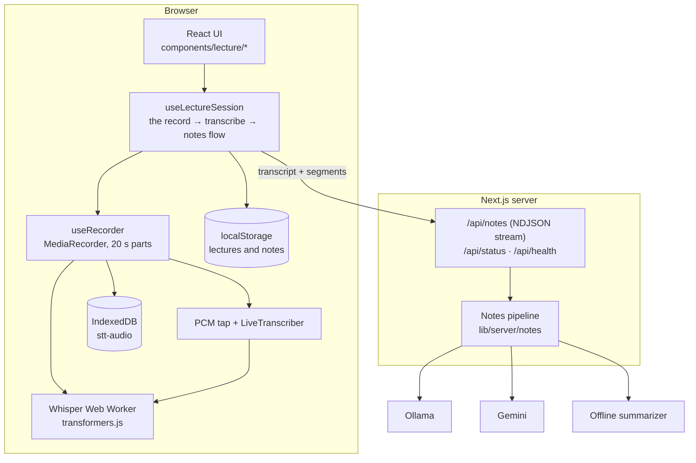

# Architecture

Lectern is a Next.js (App Router) application. Almost everything runs in the browser; the server exists to talk to
language models, which cannot be called safely from a page.

## The recording flow

`hooks/use-lecture-session.ts` owns the whole flow and all state; components only render it.

1. **Open a source** (`lib/audio/capture.ts`): microphone, tab/screen audio, or both mixed through a Web Audio graph. Every
   failure maps to an explicit error (`denied`, `cancelled`, `no-audio`, `unavailable`, `unsupported`).
2. **Record.** `useRecorder` runs a `MediaRecorder` in 20-second cycles. Each cycle is a _standalone_ file so it can be
   decoded and transcribed on its own. Data is flushed every 2 s.
3. **Persist** (`lib/audio-store.ts`). A session is written to IndexedDB immediately. The growing part is re-written every 2 s
   (`complete: false`), and replaced by the final file when the cycle ends. Session id equals lecture id.
4. **Transcribe** (`lib/stt/pipeline.ts`). Parts are decoded to 16 kHz mono and passed, one at a time, to the Whisper
   worker. Results are stored on the part itself (`status`, `segments`), so retry, resume and re-transcribe only do the
   missing work, and timestamps stay right because finished parts still advance the timeline.
5. **Live draft** (`lib/stt/live.ts`). A second consumer of the same stream feeds a 60 s ring buffer
   (`lib/audio/pcm-buffer.ts`). Every few seconds the audio since the current part began is decoded and shown as a draft.
   It is skipped whenever the model has real work, and dropped when its part ends.
6. **Finalize.** Wait for the queue, build the transcript from segments, save the lecture, request notes.

## Storage

| Data                                          | Where                                                          | Why                                               |
| --------------------------------------------- | -------------------------------------------------------------- | ------------------------------------------------- |
| Lecture metadata, transcript, segments, notes | `localStorage` (`stt.lectures.v1`), validated with zod on read | Small, synchronous, survives reloads              |
| Audio parts and per-part transcription state  | IndexedDB `stt-audio` (`sessions`, `chunks`)                   | Large blobs, written incrementally                |
| Whisper models                                | Cache Storage `transformers-cache`                             | Managed by transformers.js; removable from the UI |

The internal names keep the project's original `stt` prefix so existing data keeps working.

## Failure model

- IndexedDB unavailable: recording still works; the UI says it will not survive a crash.
- Whisper fails to load: audio is kept, parts are marked failed, **Retry** transcribes only those.
- Sharing stops or the device disappears: the recording ends cleanly and what was captured is kept.
- Model output invalid: one repair attempt, then the next engine (or the offline summarizer for that part).
- Server unreachable: the browser generates notes with the offline summarizer.
- Unfinished sessions older than 30 s are offered for recovery on the next visit; sessions written to recently belong to
  another tab and are left alone.

## Server

| Endpoint          | Purpose                                                                                                                                                                                                               |
| ----------------- | --------------------------------------------------------------------------------------------------------------------------------------------------------------------------------------------------------------------- |
| `POST /api/notes` | Validates the body (zod), applies size and rate limits, runs the pipeline; with `stream: true` answers with newline-delimited JSON (`progress`, then `result` or `error`). Stops the model if the client disconnects. |
| `GET /api/status` | Which engines are reachable and which model would be used                                                                                                                                                             |
| `GET /api/health` | Liveness probe without external calls                                                                                                                                                                                 |

All errors share one shape, `{ "error": "...", "code": "..." }`. The rate limiter is in-memory and per process.

## Error reporting

`lib/monitoring.ts` logs structured errors and optionally POSTs them to `NEXT_PUBLIC_ERROR_REPORT_URL`. `instrumentation.ts`
reports server request errors; `app/error.tsx` and `app/global-error.tsx` report rendering errors.
